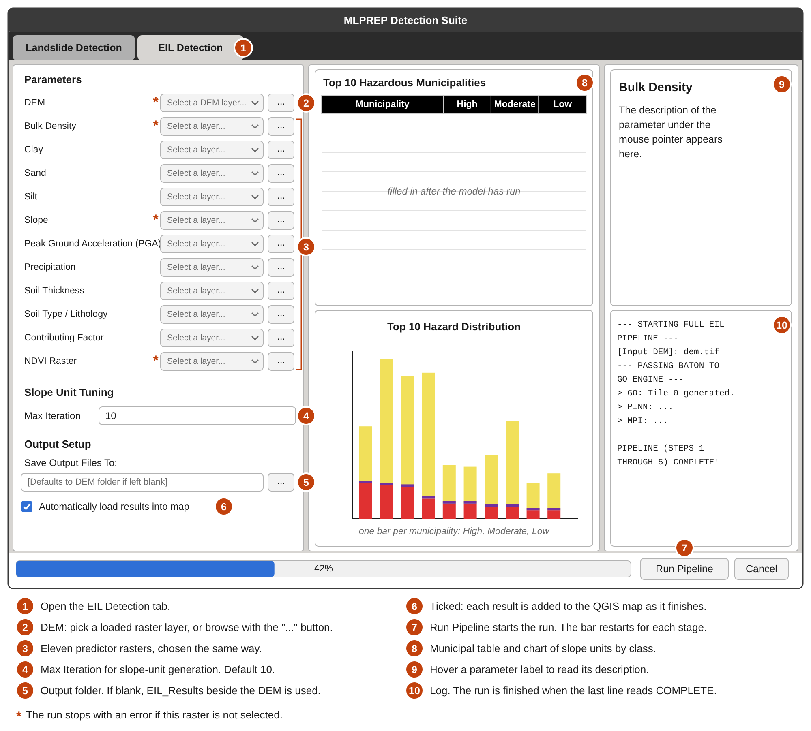
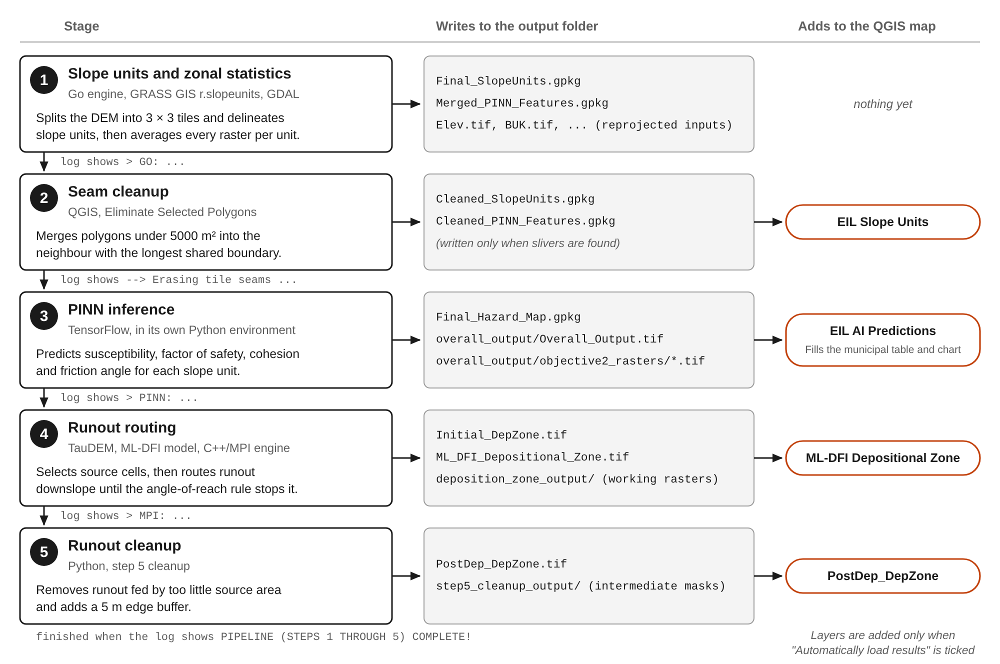

# MLPREP Detection Suite v4.4

**Status: current version.** This is the version to install and to cite.
[Back to the repository overview](../README.md).

A QGIS plugin for earthquake-induced landslide (EIL) susceptibility mapping with a
physics-informed neural network (PINN). From one window it generates slope units from a
DEM, aggregates predictor rasters over them, runs the trained PINN, and routes potential
runout from the susceptible slopes. A second tab detects landslides that have already
happened from Sentinel-2 imagery.

> The complete v4.4 folder is on branch `MLPREP_Plugin_V4_3`. The older branch
> `MLPREP_Plugin_V4_1` holds only two of its files.

This guide was written from the v4.4 source code (commit `8d94814`). The interface
picture below is a diagram drawn from the layout code, not a screenshot.

## Contents

- [Folder contents](#folder-contents)
- [Changes from v4.3](#changes-from-v43)
- [Requirements](#requirements)
- [Installation](#installation)
- [Running an EIL analysis](#running-an-eil-analysis)
- [Input rasters](#input-rasters)
- [What Run Pipeline does](#what-run-pipeline-does)
- [Output files](#output-files)
- [Reading the results](#reading-the-results)
- [Messages you may see](#messages-you-may-see)
- [The Landslide Detection tab](#the-landslide-detection-tab)
- [Models and data](#models-and-data)
- [Known issues](#known-issues)

## Folder contents

| Path | Role |
| --- | --- |
| `mainPlugin.py`, `merged_wrapper.py` | QGIS entry point and the window with both tabs |
| `eil_mainwindow.py`, `landslide_mainwindow.py` | Interface layouts |
| `ml-prep-scripts/main.go` | Go engine: parallel slope-unit generation and zonal statistics |
| `pinn_inference.py`, `py_files/` | PINN inference and the model's custom layers |
| `model/my_model.keras` | The PINN the plugin loads |
| `ml_dfi_handoff/` | Runout workflow: baseline alpha, ML-DFI model application, source refinement, C++/MPI routing engine, cleanup |
| `model_dfi/` | Trained ML-DFI model and its metadata |
| `landslide_worker.py`, `model_lsi/` | Landslide Detection tab |
| `Sample Data/` | Sample inputs and outputs for the runout workflow (Makilala) |
| `web_runner.py` | Runs the same pipeline from the command line, without the QGIS window |

## Changes from v4.3

- **Runout sources are refined.** A cell is a source only in a slope unit with
  susceptibility of at least 0.5 and a factor of safety of 1.5 or less. v4.3 used every
  cell with a filtered susceptibility above 0.01.
- **ML-DFI predictors match the model's training data.** Distances to stream and ridge are
  TauDEM flow-path distances instead of straight-line distances, continuous predictors
  get a 3 × 3 mean filter, and the stream threshold is 1500 instead of 100.
- **Step 5 is a cleanup, not a spread.** It removes runout fed by under 200 m² of source
  area and adds a 5 m buffer, using a computed source contributing area. v4.3 ran the
  post-depositional spread with placeholder inputs.
- **Step 6 is no longer called.** In v4.1 to v4.3 it was requested under a file name that
  does not exist, so it never ran.
- **Output names changed.** The final footprint is `PostDep_DepZone.tif`.
- **Smaller download.** Sample rasters over 50 MB and the landslide CNN are excluded.

## Requirements

The plugin drives several outside programs. If one is missing, the run stops at the stage
that needs it. The search paths below are the ones written into the code, which targets
macOS with Homebrew.

| Requirement | Used for | Where the plugin looks |
| --- | --- | --- |
| QGIS 3 | Hosts the plugin | — |
| Go | Runs the slope-unit and zonal-statistics engine (`go run .`) | `/opt/homebrew/bin/go`, `/usr/local/bin/go`, or `go` on the `PATH` |
| GRASS GIS 8.3 or 8.4 with the `r.slopeunits` add-on | Slope-unit delineation | `/Applications/GRASS-8.4.app` or `GRASS-8.3.app`; add-on in `~/.grass8/addons` |
| GDAL command-line tools | Reprojecting rasters (`gdalwarp`) | `PATH` |
| TauDEM | Pit filling, D-Infinity flow, distances | `~/.mlprep_envs/venv/bin`, `/usr/local/taudem`, `/usr/local/bin`, `/opt/homebrew/bin`, `~/miniconda3/bin` |
| MPI (`mpiexec`) | TauDEM and the routing engine, on 4 processes | `/opt/homebrew/bin`, `/usr/local/bin`, else `PATH` |
| Compiled routing engine | Runout routing | `MLPREP_Plugin_v4_4/ml_dfi_handoff/steps/step4_deposition_zone/cpp_mpi_port/build_manual/step4_deposition_zone_mpi` |
| Administrative boundaries | Municipal table and chart; region picker in the Landslide Detection tab | `MLPREP_Plugin_v4_4/roi_data/` (not included, see [Known issues](#known-issues)) |

Python packages are installed by the plugin itself into two virtual environments in
`~/.mlprep_envs`, from `requirements_eil.txt` and `requirements_ls.txt`.

## Installation

1. Get the branch that holds the complete plugin:

   ```bash
   git clone --branch MLPREP_Plugin_V4_3 https://github.com/veneficusg-collab/mlprep-qgis-plugins.git
   ```

2. Copy the plugin folder into the QGIS plugins folder. On macOS:

   ```bash
   cp -R mlprep-qgis-plugins/MLPREP_Plugin_v4_4 \
     "$HOME/Library/Application Support/QGIS/QGIS3/profiles/default/python/plugins/"
   ```

3. Start QGIS and enable **MLPREP Detection V4.4** under Plugins → Manage and Install Plugins.

4. Open the plugin from the toolbar icon or Plugins → MLPREP Suite. On first launch, answer
   **Yes** to "First Time Setup Required". This creates the two Python environments and can
   take several minutes.

5. Install the packages the setup does not cover:

   ```bash
   ~/.mlprep_envs/venv/bin/python -m pip install rasterstats xgboost
   ~/.mlprep_envs/ls_detect_env/bin/python -m pip install scikit-image
   ```

6. Install the `r.slopeunits` add-on from inside a GRASS session:

   ```
   g.extension extension=r.slopeunits
   ```

7. Put the routing engine where the plugin looks for it. A macOS (arm64) build ships in
   `build_mac/`:

   ```bash
   cd MLPREP_Plugin_v4_4/ml_dfi_handoff/steps/step4_deposition_zone/cpp_mpi_port
   cp build_mac/step4_deposition_zone_mpi build_manual/
   ```

   To rebuild it instead, see the `README.md` in that folder.

8. Add the boundary shapefiles to `MLPREP_Plugin_v4_4/roi_data/` (see [Known issues](#known-issues)).

## Running an EIL analysis



1. **Load your rasters into QGIS.** Every raster layer in the project appears in each
   dropdown. You can skip this and browse to files instead.
2. **Open the plugin** and click the EIL Detection tab.
3. **Choose the DEM** in the first row: pick a layer from the dropdown, or click `...`
   and select a GeoTIFF.
4. **Choose the other eleven rasters** the same way. Hover a row's label to read its
   description in the panel on the right.
5. **Set Max Iteration** if you want something other than the default of 10. The other
   slope-unit settings are fixed in the code (see below).
6. **Choose an output folder.** Use a new, empty folder for every run. The engine reuses
   any reprojected raster it already finds in the folder, so a changed input would be
   ignored. If the field is left blank, `EIL_Results` beside the DEM is used.
7. **Leave "Automatically load results into map" ticked** to see each result appear in
   QGIS as it finishes.
8. **Click Run Pipeline.** The button is disabled while the run is in progress.
9. **Watch the log.** The progress bar reaches 100% several times, once per stage. The run
   is finished when the log shows `PIPELINE (STEPS 1 THROUGH 5) COMPLETE!`.
10. **Style the results in QGIS.** Layers are loaded without styling.

Fixed slope-unit settings (`r.slopeunits.create`): `thresh` 5000 m², `areamin` 5000 m²,
`cvmin` 0.15, `rf` 10. The DEM is processed in 3 × 3 tiles with a 500-pixel overlap.

## Input rasters

Each row takes a GeoTIFF. The units are the ones the code assumes; it does not check them.

| Row in the interface | Content | Unit the code assumes | Note |
| --- | --- | --- | --- |
| DEM | Elevation | Metres, in a projected CRS | Required. Sets the grid and CRS for every other raster |
| Bulk Density | Soil bulk density | g/cm³ × 100 | Required. Slope-unit means above 50 are converted to unit weight in kN/m³ |
| Clay, Sand, Silt | Soil texture fractions | g/kg | Combined into a USDA texture class |
| Slope | Slope angle | Degrees | Required. Slope units with a mean below 10° are dropped |
| Peak Ground Acceleration (PGA) | Ground shaking | g | |
| Precipitation | Rainfall | mm per month | |
| Soil Thickness | Depth of soil | Metres | |
| Soil Type / Lithology | Soil class | Category codes | Read, but numeric codes are replaced with "Unknown" |
| Contributing Factor | Catchment area | Not stated in the code | |
| NDVI Raster | Vegetation index | −1 to 1 | Required. Used by the runout stage |

Use a DEM in a projected CRS with metre units. The 5000 m² slope-unit thresholds, the 200 m
runout cap and the 5 m buffer all assume metres.

## What Run Pipeline does



One click runs five stages in order. Each starts only when the one before it has finished.
If a stage fails, the log shows the error (in most stages marked `[CRITICAL ERROR]`), Run
Pipeline is enabled again, and the files from earlier stages stay in the folder.

Runout sources are cells that lie in a slope unit with susceptibility of at least 0.5, have
a factor of safety of 1.5 or less, and have a slope of at least 10°. Routing follows
D-Infinity flow paths and stops when the angle from the source falls below the path's
angle of reach, or at 200 m. The modelled runout has not been validated against mapped
landslide deposits.

## Output files

Everything is written to the output folder you chose.

| File | Type | Contains |
| --- | --- | --- |
| `Final_Hazard_Map.gpkg` | Polygons | One row per slope unit with the model results |
| `PostDep_DepZone.tif` | Raster | Final runout footprint, cleaned and buffered |
| `ML_DFI_Depositional_Zone.tif` | Raster | Runout cells beyond the source cells, before cleanup |
| `Initial_DepZone.tif` | Raster | Runout footprint including the source cells, before cleanup |
| `Final_SlopeUnits.gpkg`, `Cleaned_SlopeUnits.gpkg` | Polygons | Slope units before and after seam cleanup |
| `Merged_PINN_Features.gpkg`, `Cleaned_PINN_Features.gpkg` | Polygons | Slope units with the mean of every input raster |
| `overall_output/Overall_Output.tif` | Raster | Susceptibility per slope unit, set to 0 where a separate factor of safety is 1.25 or more |
| `overall_output/objective2_rasters/` | Rasters | `Susceptibility`, `Cohesion`, `Internal_Friction_Angle`, `Saturation_Ratio`, `FactorOfSafety` |
| `deposition_zone_output/` | Rasters | TauDEM grids, runout predictors, the source mask, and `step4_dfs.tif` (flow-path distance from the source) |
| `step5_cleanup_output/` | Rasters | Intermediate masks from the cleanup, with a JSON summary |
| `Elev.tif`, `BUK.tif`, `Slope.tif` and others | Rasters | The inputs reprojected to the DEM's CRS |

The `Cleaned_*` files are written only when slivers under 5000 m² are found.

## Reading the results

**Municipal table and chart.** Each slope unit is assigned to the municipality that contains
its centroid and counted in one of three classes by its `Hazard_Susceptibility` value:

| Class | `Hazard_Susceptibility` |
| --- | --- |
| High | above 0.66 |
| Moderate | 0.33 to 0.66 |
| Low | below 0.33 |

The table lists the ten municipalities with the most High-class units. The numbers are
counts of slope units, not landslides.

**Fields of `Final_Hazard_Map.gpkg`** (loaded as "EIL AI Predictions"):

| Field | Meaning | Unit or range |
| --- | --- | --- |
| `Hazard_Susceptibility` | Model output for the slope unit | 0 to 1 |
| `FactorOfSafety` | Factor of safety from the model's physics layer | Dimensionless |
| `Displacement` | Newmark displacement estimate from the physics layer | Model units |
| `Cohesion` | Predicted effective cohesion | kPa |
| `Internal_Friction` | Predicted internal friction angle | Radians; multiply by 57.296 for degrees |
| `Wetness` | Saturation ratio | 0 to 1 |
| `FoS_DFI` | A second factor of safety, recomputed outside the model | 0.01 to 10 |
| `Susceptibility_DFI` | Susceptibility, set to 0 where `FoS_DFI` is 1.25 or more | 0 to 1 |

The runout rasters are masks: cells with the value 1 are inside the modelled runout.

Susceptibility is a model score, not a calibrated probability. Cohesion and friction angle
are model-derived quantities and have not been validated against geotechnical measurements.

## Messages you may see

| Message | Cause | What to do |
| --- | --- | --- |
| "Please select a DEM." | No DEM chosen | Choose one in the first row |
| "The NDVI Raster is required for Depositional Zone modeling." | NDVI row left empty | Choose an NDVI raster |
| "Bulk Density and Slope raster(s) required for the FoS source refinement." | One of those rows left empty | Choose both |
| `[WARN] Imputing missing required input: ...` | Another raster was left empty | The model filled in a placeholder value. Select every raster and rerun |
| `[CRITICAL ERROR] Go engine crashed with exit code ...` | Go, GRASS, `r.slopeunits`, `gdalwarp` or `rasterstats` is missing, or a raster could not be read | Read the `> GO:` lines just above it in the log |
| `[WARNING] AI Model not found at: ...` | `model/my_model.keras` is missing | Restore the file to the plugin folder |
| "AI Prediction Failed" | The inference script stopped, often a missing package in `~/.mlprep_envs/venv` | Read the traceback under it in the log |
| `[WARN] Manifest not found ... Skipping data scaling.` | The preprocessing manifest is absent | See [Known issues](#known-issues) |
| `[Warning] Municipality ROI shapefile not found.` | `roi_data/` is missing | Add the boundary file; the run itself is unaffected |
| "TauDEM not found. Please install TauDEM." | `pitremove` is in none of the folders searched | Install TauDEM into one of them |
| "C++ routing executable not found" | The routing engine is not in `build_manual/` | Copy or build it there |
| "No legal Step 4 source cell exists." | No cell passed the source rules | Check that some slope units reach susceptibility 0.5 and that slope is in degrees |

## The Landslide Detection tab

This tab is separate from the EIL analysis. It maps landslides that have already happened,
from Sentinel-2 images taken before and after an event.

1. Choose a **Detection Algorithm**: "Ensemble (Otsu + CNN)", "Otsu's Method Only" or
   "CNN Deep Learning Only".
2. Choose the files with the **Choose File** buttons: a DEM, the post-event image, and the
   pre-event image (not asked for in CNN-only mode). A land-cover shapefile is optional.
3. Choose the area under **Region of Interest**: type a place name, or pick a level
   (Region, Province, Municipality, Barangay) and a name.
4. Click **DETECT**. QGIS does not respond until the detection finishes.
5. Click **SAVE** to export the result as a GeoTIFF. Until then it is only a temporary file.

| Algorithm | Rule |
| --- | --- |
| Otsu | Computes the change in NDVI between the two images, keeps terrain at 50 m elevation or more with a slope of 20% or more, and flags pixels whose NDVI change falls below an Otsu threshold |
| CNN | Feeds the post-event bands, slope and elevation to the trained network in tiles and flags pixels with a probability above 0.5 |
| Ensemble | Flags only the pixels that both methods flag |

With a land-cover shapefile, pixels in built-up, inland water, marsh, open or barren, and
annual crop classes are removed from the result, with a 10 m buffer.

## Models and data

- **PINN.** The plugin loads `MLPREP_Plugin_v4_4/model/my_model.keras`. The other `.keras`
  files in that folder are not referenced by the plugin.
- **ML-DFI model.** `model_dfi/trained_ml_dfi_model.pkl`, with its training record in
  `model_dfi/model_metadata.json`.
- **Landslide detection CNN.** `model_lsi/default/best.keras` is not in the v4.4 folder.
  A copy is in `MLPREP_Plugin_v4_3/model_lsi/default/`.
- **Sample data.** `Sample Data/` holds inputs and outputs of the runout workflow for
  Makilala. Rasters over 50 MB are excluded from the repository (listed in `.gitignore`).
  The predictor rasters for the PINN stage are not included.

## Known issues

Setup:

- `requirements_eil.txt` omits `rasterstats` and `xgboost`, and `requirements_ls.txt` omits
  `scikit-image`. Install them as shown under [Installation](#installation).
- The routing engine's macOS build is in `build_mac/`, but the plugin looks in `build_manual/`.
- `roi_data/` is not in the repository. The plugin expects the PSA–NAMRIA administrative
  boundary shapefiles there, named `phl_admbnda_adm1_psa_namria_20231106.shp` to
  `phl_admbnda_adm4_psa_namria_20231106.shp`.
- The preprocessing manifest `feature_manifests/v1_cotabato_transforms_production.json` is not
  in the repository. Without it, inference runs with a warning and skips the log and clip
  transforms.
- Tool paths are written for macOS with Homebrew.

Interface:

- The chart's axis reads "Number of Landslides". The values are counts of slope units by
  class, not landslides.
- **Cancel** does not stop a run. It writes a line to the log and resets the progress bar,
  but the programs already started keep going.
- Every stage drives the same progress bar, so 100% does not mean the run is over.
- The DEM row's `...` button is wired to two file dialogs, so expect to be asked for the
  file twice.

## Citation and licence

See the [repository overview](../README.md#citation).
